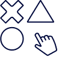

# Step<!DOCTYPE html>
<html lang="ru">

<head>
   <meta charset="UTF-8">
   <meta http-equiv="X-UA-Compatible" content="IE=edge">
   <meta name="viewport" content="width=device-width, initial-scale=1.0">
   <link href="https://fonts.googleapis.com/css2?family=Montserrat:wght@400;500;600;700&display=swap" rel="stylesheet">
   <link href="https://cdn.jsdelivr.net/npm/bootstrap@5.0.2/dist/css/bootstrap.min.css" rel="stylesheet"
      integrity="sha384-EVSTQN3/azprG1Anm3QDgpJLIm9Nao0Yz1ztcQTwFspd3yD65VohhpuuCOmLASjC" crossorigin="anonymous">
   <link rel="stylesheet" href="https://unpkg.com/swiper@8/swiper-bundle.min.css" />
   <link rel="stylesheet" href="css/style.css">
   <link rel="shortcut icon" href="./img/icon-logo-cross-white.png" type="image/x-icon">
   <title>XOD</title>
</head>

<body>
   <header id="header" class="header">
   

      <a class="col-2" href="#">
         

            
            
            
            

               future
               academy
            

         

         

            
            
            
            

               future
               academy
            

         

      </a>
      <ul class="header_nav-list col-10">
         <li class="header_nav-item ">
            <a class="header_nav-link icon bold" href="#"> Все
               курсы</a>
         </li>
         <li class="header_nav-item mobile">
            <a class="header_nav-link" href="#">Об академии</a>
         </li>
         <li class="header_nav-item ">
            <a class="header_nav-link" href="#">Мероприятия</a>
         </li>
         <li class="header_nav-item mobile">
            <a class="header_nav-link" href="#">Новости</a>
         </li>
         <li class="header_nav-item ">
            <a class="header_nav-link" href="#">База знаний</a>
         </li>
         <li class="header_nav-item">
            <a class="header_nav-link" href="#">Карьера</a>
         </li>
         <li class="header_nav-item mobile">
            <a class="header_nav-link" href="#">Контакты</a>
         </li>
         <li class="header_nav-item ">
            <a class="header_nav-link" href="tel:+380971755598">+(380)97-175-55-98</a>
         </li>
         <li class="header_nav-item ">
            <a class="header_nav-link icon bold header_dropdown-toggle" href="#">
               Киев</a>
         </li>
         <li class="header_nav-item ">
            <a class="header_nav-link icon bold" href="#">
               Войти</a>
         </li>
         <li class="header_nav-item mobile">
            <a class="header_nav-link bold" href="https://goo.gl/maps/HxJcQSeeSKcAHKXA7" target="_blank">г. Киев, прсп.
               Бажана, д.
               50</a>
         </li>
         <li class="header_nav-item mobile">
            <a class="header_nav-link bold" href="mailto:info@hodfutureacademy.ua">info@hodfutureacademy.ua</a>
         </li>
         <li class="header_nav-item mobile">
            <ul class="header_socials-list">
               <li></li>
               <li></li>
               <li></li>
               <li></li>
               <li></li>
            </ul>
         </li>
      </ul>
      <a href="#" class="burger">
         
         
         
      </a>
   

   

      

         

            <h2 class="header_dropdown-title">Выберите свой город</h2>
            
         

         <ul class="header_dropdown-list">
            <li><a class="header_dropdown-item" href="#">Киев</a></li>
            <li><a class="header_dropdown-item" href="#">Харьков</a></li>
            <li><a class="header_dropdown-item" href="#">Одесса</a></li>
            <li><a class="header_dropdown-item" href="#">Львов</a></li>
            <li><a class="header_dropdown-item" href="#">Запорожье</a></li>
            <li><a class="header_dropdown-item" href="#">Кривой Рог</a></li>
            <li><a class="header_dropdown-item" href="#">Днепр</a></li>
            <li><a class="header_dropdown-item" href="#">Полтава</a></li>
         </ul>
      

   

</header>
   <main>
      <section id="hero" class="hero">
   

      

         <h1 class="hero_title title">Образовательная платформа ХОД Future Academy</h1>
         
Актуальные знания для новичков и профессионалов

      

   

</section>
      <section id="courses" class="courses section row">
   

      <figure class="courses_figure">
         
         <figcaption class="courses_figure-content">
            <h3 class="courses_figure-title">Кем Вы хотите стать?</h3>
            
Пора найти себя и выбрать подходящий курс :)   Удачи!

         </figcaption>
      </figure>
      
   

   

      

         <a href="#courses-kids" data-tab="1" class="courses_tab _active">
            <figure class="courses_tab-figure">
               
               <figcaption class="courses_tab-figure-content">
                  <h4>Дети</h4>
                  8 — 14 лет
               </figcaption>
            </figure>
         </a>
         <a href="#courses-teens" data-tab="2" class="courses_tab">
            <figure class="courses_tab-figure">
               
               <figcaption class="courses_tab-figure-content">
                  <h4>Подростки</h4>
                  14 — 18 лет
               </figcaption>
            </figure>
         </a>
         <a href="#courses-adults" data-tab="3" class="courses_tab">
            <figure class="courses_tab-figure">
               
               <figcaption class="courses_tab-figure-content">
                  <h4>Взрослые</h4>
                  18 +
               </figcaption>
            </figure>
         </a>
      

      

         <ul id="courses-kids" data-tab-content="1" class="courses_tab-pane _active">
            <li><a href="#">Шахматы</a></li>
            <li><a href="#">Мультимедиа</a></li>
            <li><a href="#">Английский язык</a></li>
            <li><a href="#">Робототехника</a></li>
            <li><a href="#">Электроника</a></li>
            <li><a href="#">Диджитализация</a></li>
         </ul>
         <ul id="courses-teens" data-tab-content="2" class="courses_tab-pane">
            <li><a href="#">Мультимедиа</a></li>
            <li><a href="#">Английский язык</a></li>
            <li><a href="#">Soft skills</a></li>
            <li><a href="#">Электроника</a></li>
            <li><a href="#">Дизайн</a></li>
            <li><a href="#">Програмирование</a></li>
            <li><a href="#">Web-разработка</a></li>
            <li><a href="#">Блогинг</a></li>
         </ul>
         <ul id="courses-adults" data-tab-content="3" class="courses_tab-pane">
            <li><a href="#">Мультимедиа</a></li>
            <li><a href="#">Английский язык</a></li>
            <li><a href="#">Дизайн</a></li>
            <li><a href="#">Програмирование</a></li>
            <li><a href="#">Web-разработка</a></li>
            <li><a href="#">Блогинг</a></li>
            <li><a href="#">Диджитализация</a></li>
            <li><a href="#">Soft skills</a></li>
            <li><a href="#">Электроника</a></li>

         </ul>
      

   

</section>
      <section id="video" class="video section">
   

      <a class="video_link" href="https://www.youtube.com/embed/K10Kez02kUg">
         <picture>
            <source srcset="https://i.ytimg.com/vi_webp/K10Kez02kUg/maxresdefault.webp" type="image/webp">
            
         </picture>
      </a>
      <button class="video_btn" aria-label="Start video">
         <svg height="100%" version="1.1" viewBox="0 0 68 48" width="100%">
            <path class="video_btn-shape ytp-large-play-button-bg"
               d="M66.52,7.74c-0.78-2.93-2.49-5.41-5.42-6.19C55.79,.13,34,0,34,0S12.21,.13,6.9,1.55 C3.97,2.33,2.27,4.81,1.48,7.74C0.06,13.05,0,24,0,24s0.06,10.95,1.48,16.26c0.78,2.93,2.49,5.41,5.42,6.19 C12.21,47.87,34,48,34,48s21.79-0.13,27.1-1.55c2.93-0.78,4.64-3.26,5.42-6.19C67.94,34.95,68,24,68,24S67.94,13.05,66.52,7.74z"
               fill="#f00"></path>
            <path class="video_btn-icon" d="M 45,24 27,14 27,34" fill="#fff"></path>
         </svg>
      </button>
   

</section>
      <section id="counter" class="counter section">
   

      <h3 class="counter_title">Актуальные знания от признанных экспертов рынка
         для новичков и практикующих специалистов.</h3>
      <ul class="counter_content">
         <li class="counter_content-item">
            
0

            Курсов
         </li>
         <li class="counter_content-item">
            
0

            Ведущих преподавателя
         </li>
         <li class="counter_content-item">
            
0

            Выпускников
         </li>
      </ul>
   

</section>
      <section id="events" class="activities section">
   <figure class="activities_card event">
      

         25
         ноября
      

      <!--Show when width is less than 800px-->
      <h3 class="activities_card-title event w-800">День открытых дверей</h3>
      <figcaption class="activities_card-body">
         <!--Show when width is more than 800px-->
         <h3 class="activities_card-title event">День открытых дверей</h3>
         
Приглашаем всех желающих на бесплатную экскурсию
            в мир востребованных профессий и полезных навыков

      </figcaption>
      <a href="#" class="activities_card-btn">Записаться</a>
   </figure>
   <figure class="activities_card educ">
      
      <figcaption class="activities_card-body educ">
         <h5 class="activities_card-title educ">Программы обучения</h5>
         
В списке наших курсов вы сможете найти профессию и занятие по душе,
            изучить
            новое и получить практические знания, которые помогут получить работу мечты.

         <a href="#" class="activities_card-btn">Подробнее</a>
      </figcaption>
   </figure>
   <figure class=" activities_card news">
      
      <figcaption class="activities_card-body">
         <h5 class="activities_card-title news"><a href="#">Новости Академии</a></h5>
      </figcaption>
   </figure>
   <figure class="activities_card it">
      
      <figcaption class="activities_card-body">
         <h5 class="activities_card-title it"><a href="#">Мир IT</a></h5>
      </figcaption>
   </figure>
   <figure class=" activities_card game">
      
      <figcaption class="activities_card-body">
         <h5 class="activities_card-title game"><a href="#">Попробуй!</a></h5>
         
Пройдите тест и узнайте свои способности
            в сфере информационных технологий

      </figcaption>
   </figure>
</section>
      <section id="comments" class="comments">
   <h1 class="comments_title title">Отзывы наших студентов</h1>
   

      

         

            

               <figure class="comments_card-figure">
                  
                  <figcaption class="comments_card-figcaption">
                     <h3 class="comments_card-name">Имя Фамилия</h3>
                     
Студент курса «WEB-разработчик»

                  </figcaption>
               </figure>
               
Lorem ipsu Lorem ipsum dolor sit amet consectetur adipisicing elit. Atque,
                  dolorum. sodales, scelerisque eros non, ultrices magna.
               

               

                  
               

            

         

         

            

               <figure class="comments_card-figure">
                  
                  <figcaption class="comments_card-figcaption">
                     <h3 class="comments_card-name">Имя Фамилия</h3>
                     
Студент курса «WEB-разработчик»

                  </figcaption>
               </figure>
               
Lorem ipsum dolor sit amet, consectetur adipiscing elit. Ut feugiat nisl
                  at augue dapibus, id tristique lorem placerat. Curabitur pellentesque est bibendum urna facilisis
                  varius. In hac habitasse platea dictumst. In ut dui sodales, scelerisque eros non, ultrices magna.
               

               

                  
               

            

         

         

            

               <figure class="comments_card-figure">
                  
                  <figcaption class="comments_card-figcaption">
                     <h3 class="comments_card-name">Имя Фамилия</h3>
                     
Студент курса «WEB-разработчик»

                  </figcaption>
               </figure>
               
Lorem ipsum dolor Lorem ipsum dolor sit amet consectetur, adipisicing elit.
                  Omnis possimus optio porro a doloremque culpa voluptate inventore maxime ipsam!
               

               

                  
               

            

         

         

            

               <figure class="comments_card-figure">
                  
                  <figcaption class="comments_card-figcaption">
                     <h3 class="comments_card-name">Имя Фамилия</h3>
                     
Студент курса «WEB-разработчик»

                  </figcaption>
               </figure>
               
Lorem ipsum dolor sit amet consectetur, adipisicing elit. Natus vel
                  voluptatem cupiditate amet et neque, deserunt animi officia eum consequuntur? lore10

               

               

                  
               

            

         

         

            

               <figure class="comments_card-figure">
                  
                  <figcaption class="comments_card-figcaption">
                     <h3 class="comments_card-name">Имя Фамилия</h3>
                     
Студент курса «WEB-разработчик»

                  </figcaption>
               </figure>
               
Lorem ipsum dolor sit amet consectetur, adipisicing elit. Natus vel
                  voluptatem cupiditate amet et neque, deserunt animi officia eum consequuntur? Lorem ipsum dolor sit
                  amet.

               

               

                  
               

            

         

         

            

               <figure class="comments_card-figure">
                  
                  <figcaption class="comments_card-figcaption">
                     <h3 class="comments_card-name">Имя Фамилия</h3>
                     
Студент курса «WEB-разработчик»

                  </figcaption>
               </figure>
               
Lorem ipsum dolor sit amet, consectetur adipiscing elit. Ut feugiat nisl
                  at augue dapibus, id tristique lorem placerat. Curabitur pellentesque est bibendum urna facilisis
                  varius. In hac habitasse platea dictumst. In ut dui sodales, scelerisque eros non, ultrices magna.
               

               

                  
               

            

         

         

            

               <figure class="comments_card-figure">
                  
                  <figcaption class="comments_card-figcaption">
                     <h3 class="comments_card-name">Имя Фамилия</h3>
                     
Студент курса «WEB-разработчик»

                  </figcaption>
               </figure>
               
Lorem ipsum dolor sit amet, consectetur adipiscing elit. Ut feugiat nisl
                  at augue dapibus, id tristique lorem placerat. Curaque eros non, ultrices magna.
               

               

                  
               

            

         

         

            

               <figure class="comments_card-figure">
                  
                  <figcaption class="comments_card-figcaption">
                     <h3 class="comments_card-name">Имя Фамилия</h3>
                     
Студент курса «WEB-разработчик»

                  </figcaption>
               </figure>
               
Lorem ipsum dolor sit amet consectetur, adipisicing elit. Natus vel
                  voluptatem cupiditate amet et neque, deserunt animi officia eum consequuntur? Lorem ipsum dolor sit
                  amet consectetur adipisicing elit. Itaque, molestiae?

               

               

                  
               

            

         

      

      

   

</section>
      <section id="about" class="about section">
   <h1 class="about_title title">Добро пожаловать в Академию будущего ХОД</h1>
   <ul class="about_list">
      <li class="about_list-item">
         
         
Передовой подход
            к образовательному процессу

      </li>
      <li class="about_list-item">
         
         
Непрерывное усовершенствование
            и пополнение базы курсов

      </li>
      <li class="about_list-item">
         
         
Только практикующие преподаватели

      </li>
      <li class="about_list-item">
         
         
Сопровождение на всех этапах. От начала обучения до трудоустройства

      </li>
   </ul>
</section>
      <section id="contact" class="contact section">
   

      

         <h4 class="contact_descr-title">Помочь с выбором?</h4>
         

            Оставьте заявку и наши специалисты свяжутся с вами, ответят на все вопросы
            и подберут подходящий вариант обучения.

      

      <form class="contact_form">
         <input type="text" placeholder="Ваше имя" class="contact_form-name">
         <input type="tel" placeholder="Ваш телефон +(380)" class="contact_form-phone">
         <input type="text" placeholder="Ваш e-mail" class="contact_form-email">
         
Нажимая на кнопку, я соглашаюсь
            на обработку персональных данных
            и с правилами пользования Платформой

         <button type="submit" class="contact_form-btn">Отправить</button>
      </form>
   

</section>
   </main>
   <footer class="footer section" id="footer">
   

      <ul class="footer_contact">
         <li><a class="footer_contact-link" href="#">
               

                  
                  
                  
                  

                     future
                     academy
                  

               

            </a></li>
         <li><a class="footer_contact-link" href="tel:+380971755598">+(380)97-175-55-98</a></li>
         <li><a class="footer_contact-link" href="https://goo.gl/maps/HxJcQSeeSKcAHKXA7" target="_blank">г. Киев, прсп.
               Бажана, д.
               50</a></li>
         <li><a class="footer_contact-link" href="mailto:info@hodfutureacademy.ua">info@hodfutureacademy.ua</a></li>
         <li>
            

               
               
               
               
               
            

         </li>
      </ul>
   

</footer>

   
   
   
</body>

</html>
